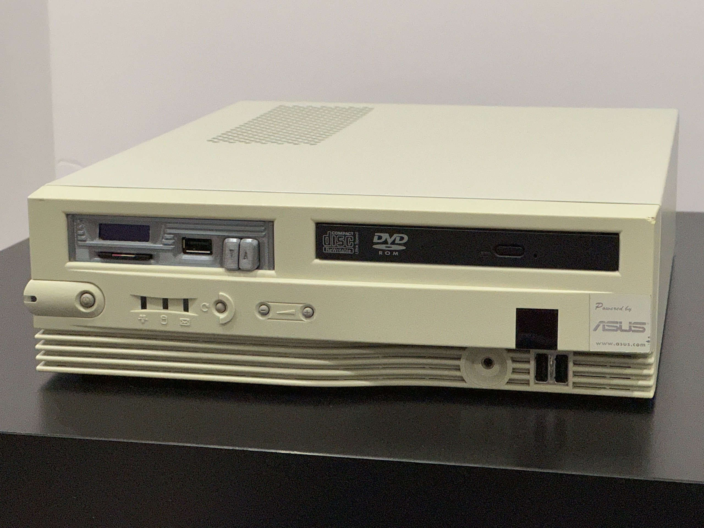
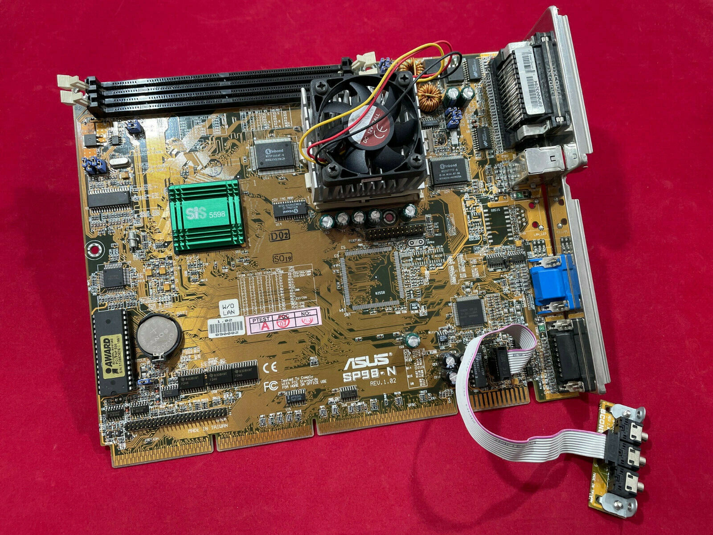
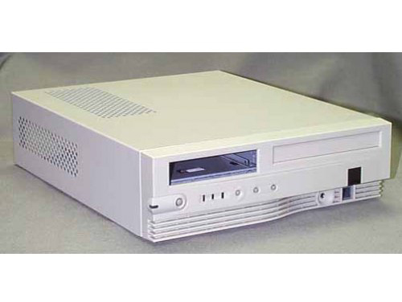

# NLX System Resources

By chance, I obtained an entire NLX form factor system from eBay. It consists of an Asus SP98-N motherboard and an ElanVital Aegis B5-N PC case.

 

According to [Wikipedia](https://en.wikipedia.org/wiki/NLX_(motherboard_form_factor), it's an old and obscure form factor that never gained much popularity back in the 90s. I was fascinated by this compact-sized system and spent a lot of time on learning what it can do, and created many stuff to enhance it for "playability" in these modern days.

Please refer to the project Wiki page for categorized articles of my findings and creations!